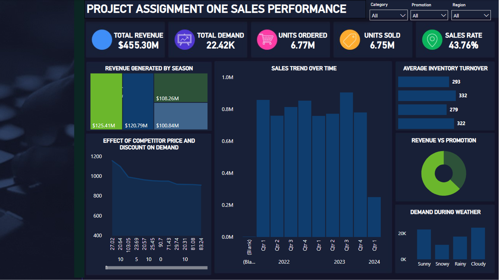

# Sales Performance Dashboard – Power BI

This repository contains an interactive Power BI dashboard built from a retail sales dataset. It provides visual insights into key business metrics such as sales volume, demand, promotions, regional performance, and seasonality.

🔗 **[Download Dashboard (.pbix)](LINK_TO_FILE)**  

---

## 📊 Dashboard Features

- 📈 Trend analysis by product category and region
- 📌 KPI cards: Total sales, orders, demand, discounts
- 🎯 Slicers for time, region, promotion, and category
- 🌦️ Weather & seasonality impact on sales
- 📉 Competitor pricing vs. store performance

---

## 🧱 File Structure

- `Project Assignment One (Sales Data) - Philip Oklu.pbix` – Full Power BI report file
- `assets/dashboard-preview.png` *(optional)* – Add a screenshot of the dashboard
- `README.md` – Project description and usage
- `.gitignore` – Optional settings for ignoring temporary or cache files

---

## 🛠 Tools Used

- Power BI Desktop
- DAX for measure calculations
- Data transformations via Power Query

---

## 📝 License

[MIT License](LICENSE)

---

## 👤 Author

Philip Oklu  
*Power BI Project | 2025*

